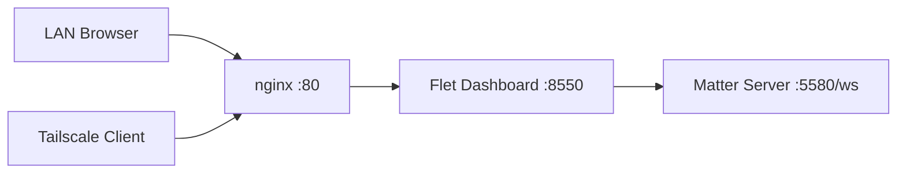

# py_app Pi3 Dashboard Stack

This repository is now the single source of truth for:

- Production dashboard code.
- Pi3 deployment and cleanup scripts.
- Service configuration (systemd + nginx).
- Runtime status checks and troubleshooting workflow.

The stack is designed to stay lightweight and Pi-friendly:

- Python app process for dashboard.
- systemd for startup/restart.
- nginx as reverse proxy on port 80.
- tailscale kept active for remote admin and compatibility.
- matter-server retained for garage device control.

## Runtime pinning policy

The dashboard runtime is pinned to:

- flet 0.28.3
- flet-web 0.28.3
- flet-cli 0.28.3

Reason:

- Newer flet-web versions in this environment do not include packaged web runtime files (`flet_web/web`), which leads to HTTP 500 from the dashboard service.
- 0.28.3 includes the required embedded web assets and is currently the stable Pi3 baseline for this project.

## Target architecture (Pi3)



## Sensor history logging

Water level and pressure readings from the PLC are logged to a local SQLite
database for trend history:

- `app/sensor_store.py` — `SensorDatabase`: SQLite (WAL mode) schema and raw
  read/write/prune operations.
- `app/sensor_logger.py` — `SensorLogger`: averages readings over a 5s window,
  then batches the resulting means to disk every ~60s (limits SD card wear).
- `app/sensor_chart.py` — `SensorChartControl`: canvas-based dual-axis chart
  (water level in liters, pressure in bar) shown on the dashboard, refreshed
  every 60s over a trailing 1-hour window.
- Retention: rows older than 365 days are pruned automatically.
- Database file: `data/sensor_log.db` (git-ignored, created on first run).

### Exporting history

```powershell
python -m app.sensor_query --range 1h   # or 1d / 30d / max
python -m app.sensor_query --range 30d --out history.csv
```

## Garage door control

Garage doors are pulsed directly via the Matter `ACTIVATE` buttons once the
Matter connection to a door node is online — there is no separate arm/unlock
gesture gating activation.

## Canonical runtime locations on Pi

- Project root: `/home/neulas/projects/py_app`
- Python venv: `/home/neulas/projects/py_app/.venv`
- Dashboard service unit: `/etc/systemd/system/py-app-dashboard.service`
- nginx site file: `/etc/nginx/sites-available/py-app-dashboard.conf`
- nginx enabled link: `/etc/nginx/sites-enabled/py-app-dashboard.conf`

## Repo operations directory

- `ops/pi/deploy.py`
	- SSH deploy entrypoint from your development machine.
	- Bundles this repo and applies remote provisioning.
- `ops/pi/provision_remote.sh`
	- Installs runtime dependencies.
	- Creates/updates venv and installs Python package.
	- Installs systemd and nginx config from repo.
- `ops/pi/cleanup_nonessential.sh`
	- Stops/disables/masks non-essential services requested for cleanup.
	- Handles headscale and wg-quick@wg0.
- `ops/pi/statuscheck_remote.sh`
	- Full runtime check for dashboard/nginx/tailscale/ports/http.
- `ops/pi/systemd/py-app-dashboard.service`
	- Source-controlled service definition.
- `ops/pi/nginx/py-app-dashboard.conf`
	- Source-controlled reverse proxy config.

## Access URLs

- LAN URL (recommended for family):
	- `http://192.168.1.95`
- Direct app port (debug only):
	- `http://192.168.1.95:8550`
- Tailscale URL by tailnet IP:
	- `http://100.123.208.10`

If the Pi IP may change, set a DHCP reservation for the Pi in your router.

## One command deploy over SSH

From repo root on your development machine:

```powershell
python .\ops\pi\deploy.py --ssh-target rpi3 --project-path /home/neulas/projects/py_app --cleanup-nonessential
```

What this does:

1. Bundles this repository while excluding heavy local folders (`.venv`, `build`, `site-packages`, `.git`).
2. Uploads and extracts to the Pi project path.
3. Cleans non-essential services (headscale + wg0) when requested.
4. Re-applies service and nginx config from this repo.
5. Runs status checks automatically.

### Optional hard removal of headscale package

```powershell
python .\ops\pi\deploy.py --ssh-target rpi3 --project-path /home/neulas/projects/py_app --cleanup-nonessential --purge-headscale
```

Use `--purge-headscale` only if you are sure no device depends on this Pi-hosted headscale.

## Manual remote operations

Use these when you need direct control or forensic debugging.

### Provision only

```bash
bash /home/neulas/projects/py_app/ops/pi/provision_remote.sh /home/neulas/projects/py_app
```

### Cleanup non-essential services only

```bash
bash /home/neulas/projects/py_app/ops/pi/cleanup_nonessential.sh no
```

### Full status check

```bash
bash /home/neulas/projects/py_app/ops/pi/statuscheck_remote.sh
```

## Service controls

```bash
sudo systemctl restart py-app-dashboard.service
sudo systemctl status py-app-dashboard.service --no-pager --full
sudo journalctl -u py-app-dashboard.service -n 200 --no-pager
```

## Nginx controls

```bash
sudo nginx -t
sudo systemctl reload nginx
sudo systemctl status nginx --no-pager --full
```

## Tailscale controls

```bash
sudo systemctl status tailscaled.service --no-pager --full
tailscale status
tailscale serve status
tailscale funnel status
```

## Matter connectivity checks

```bash
sudo ss -ltnp | grep ':5580'
```

Dashboard code expects Matter websocket at:

- `ws://192.168.1.95:5580/ws`

If Matter host or port changes, update constants in `main.py` and redeploy.

## Troubleshooting playbook

### Symptom: service active but browser shows error

1. Check direct app response:

```bash
curl -I http://127.0.0.1:8550
```

2. If you see HTTP 500, inspect app logs:

```bash
sudo journalctl -u py-app-dashboard.service -n 300 --no-pager
```

3. Confirm reverse proxy health:

```bash
curl -I http://127.0.0.1
sudo tail -n 200 /var/log/nginx/error.log
```

4. Verify listeners:

```bash
sudo ss -ltnp | egrep ':(80|443|8550|5580)\b'
```

### Symptom: dashboard loads but doors do not trigger

1. Check Matter server listener on 5580.
2. Check dashboard logs for websocket command errors.
3. Confirm right and left node IDs in `MATTER_DOORS` in `main.py`.

## Cleanup policy used by this project

Removed from active use:

- Windows-only scheduled-task launcher workflow.
- Windows fixed-IP runbook.
- headscale service (disabled/masked in cleanup).
- wg-quick@wg0 service (disabled/masked in cleanup).

Kept as essential:

- tailscaled service.
- nginx reverse proxy.
- py-app-dashboard systemd service.
- matter-server process.

## Cleanup scope and safety

Automated cleanup removes or disables only components marked non-essential for this project runtime:

- headscale service and optional package purge.
- wg-quick@wg0 service disable/mask/reset-failed.
- legacy nginx site symlinks related to old stack variants.

If you later need headscale or WireGuard again, restore those services explicitly and remove the masks.

## Development model

- Develop in this repository only.
- Deploy through SSH only (via `ops/pi/deploy.py`).
- Keep all production config files under version control in this repo.
- When diagnosing incidents, check this repo first for:
	- Service definitions.
	- Proxy configuration.
	- Deployment flow.
	- Statuscheck commands.
