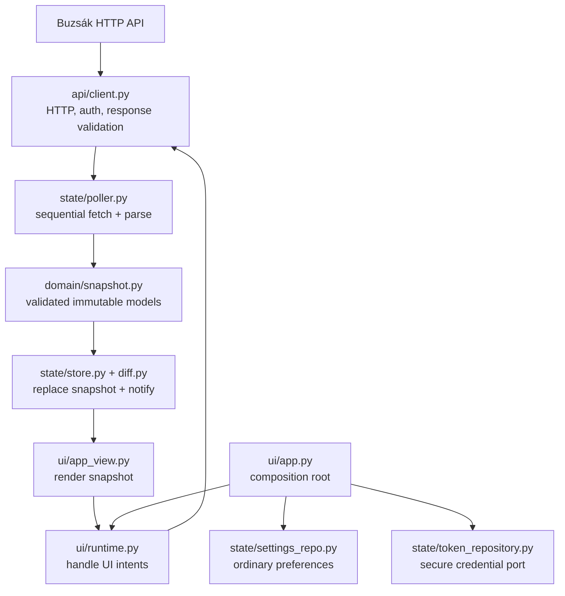
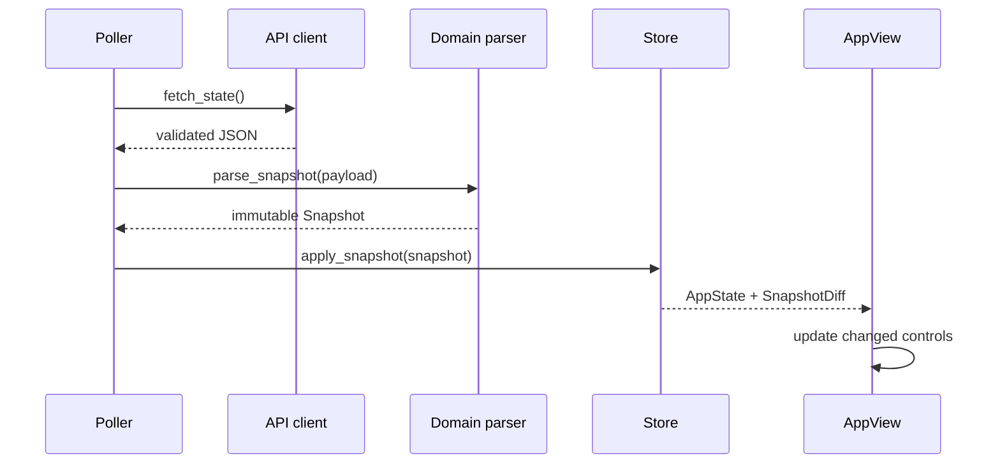

# Architecture

Covers ARC-04..ARC-10, ARC-06, SRV-10, DOC-02.

## Module boundaries

`ui/app.py` is the composition root: it attaches Flet services, loads settings, selects fake/live session configuration, constructs `Runtime`, and starts it. `Runtime` owns the API client, poller, store and `AppView`; it also coordinates command and pulse lifecycles and restarts the connection when settings change. `AppView` is presentation-only: it builds tabs, subscribes to store updates, applies diffs and forwards user intents through callbacks.

`api/` is the only package that performs HTTP (`SRV-10`). It returns validated JSON objects and typed transport errors; `domain/` parses snapshots into frozen dataclasses and represents value quality explicitly. `state/` owns the immutable application snapshot, diffs, serialized polling, ordinary settings persistence and the secure-token repository protocol. `ui/runtime.py` is the UI-layer orchestrator for commands because its workflows are initiated and rendered by controls; it never mutates reported physical state optimistically.

## Data and command flows

Controls dispatch intents to `Runtime`. Idempotent valve commands use the server command API and its status endpoint; the garage pulse is a single non-idempotent POST, then GET-only snapshot observation. `Runtime` never retransmits a pulse. In both cases, server-reported snapshots/status remain authoritative.

## Security and settings

URL, poll interval and timeouts use Flet `SharedPreferences`; the serialized `Settings` intentionally excludes the token. After an authenticated state snapshot validates, the token is stored through `SecureTokenRepository` backed by Flet Secure Storage / Android Keystore (ADR-0006). Sign out removes it. Fake/live launcher credentials are session-only. Server-side expiry and revocation remain authoritative.

## Guardrails and tests

`tests/test_architecture.py` enforces downward package imports, keeps Flet out of `api/`, `domain/` and `state/`, ensures HTTP client imports remain within `api/`, and checks that the composition root, view and Runtime stay in separate modules. Behavior and lifecycle contracts are tested in the domain, state, API, UI and loopback fake-server suites. The fake server binds to loopback and never contacts real devices.
